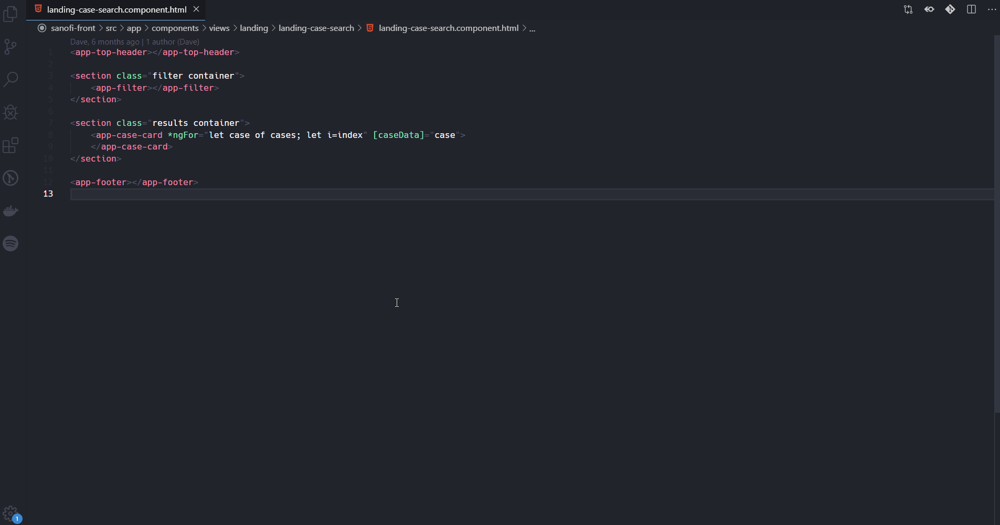
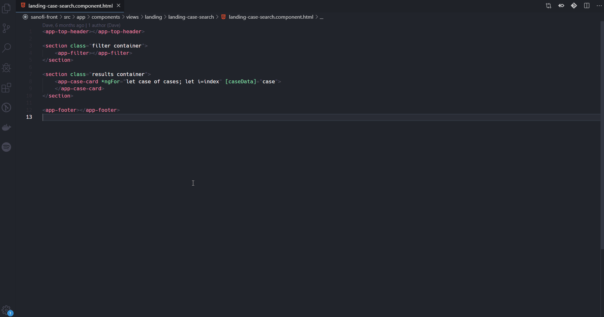

# Angular preview component

The Angular preview component extension will help you to go trough the flow of component handling in Angular, you are required to be active in one of the dependency files of your component HTML, TS or CSS.

## Supported file **extensions**
* HTML
* TS
* CSS
* SCSS
* SASS

## Extension Settings

This extension contributes the following settings:

* `ng-prev-component.openInColumn`: `true | false` Opens dependency files in new Column of editor

## Known Issues

## Release Notes

### 1.0.0

Initial release of Angular preview component
